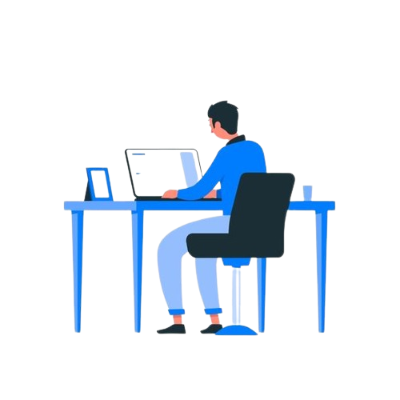

<!--h1 without bottom border-->

  <ul align="center">
    
<h1 style="display: inline-block">Hi 👋, I'm Juan</h1>

  </ul>
  

  <ul align="center">
    
<h2 style="display: inline-block">Learning step by step to  program</h2>

  </ul>
  

<h1> Technologies </h1>

  

    <ul>
      <li>MySQL Workbench</li>
      <li>Ruby on Rails</li>
      <li>JavaScript</li>
      <li>PHP</li>
      <li>HTML</li>
      <li>CSS</li>
    </ul>
  

  

    
  

<!-- Descriptions abut me --->

I am currently working on databases and web design. This project includes examples and applications of these technologies.

Here are some ideas to get you started:

- 🌱 I’m currently learning PHP, Mysql, Ruby,HTML, CSS, JavaScript
- 👯 I’m looking to collaborate on Michelada.io
- 💬 ask me anything
- 📫 How to reach me: Elbartoy@gmail.com and juan_nbx0
- 😄 Pronouns: men
- ⚡Learning in boredom
